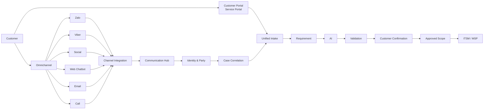

# 01 — Mô hình tổng thể Final

## 1. Kiến trúc

## 2. Phân biệt Structured và Unstructured

### Structured Intake

Nguồn: Customer Portal / Service Portal.

Dữ liệu do khách điền theo form:

- Service
- Request type
- Description
- Priority/impact nếu cho phép
- Asset/CI
- Requested date
- Attachment

Luồng:

`Portal → Unified Intake → Requirement → ITSM`

### Omnichannel Intake

Nguồn:

- Zalo
- Viber
- Social
- Web Chatbot
- Email
- Call

Luồng:

`Channel → Connector → Communication Hub → Identity → Case Correlation → Unified Intake`

## 3. Không tạo Ticket trùng

Portal đã tạo `CASE-00125`.

Khách tiếp tục:

- hỏi Zalo
- gửi Email
- gọi Call

thì hệ thống phải link các Communication Event vào `CASE-00125`, không tạo `CASE-00126`, `CASE-00127`, `CASE-00128` nếu đó vẫn là cùng một yêu cầu.

## 4. Trường hợp yêu cầu mới

Nếu khách dùng Zalo đang nói về một việc khác:

`Existing Case Context → New Intent → Correlation fails → New Case`

Do đó Omnichannel vừa có khả năng **link Existing Case**, vừa có khả năng **New Intake**.

## 5. Final principle

> **One Customer / Case – Multiple Conversations – Multiple Channels – One Operational Truth.**
