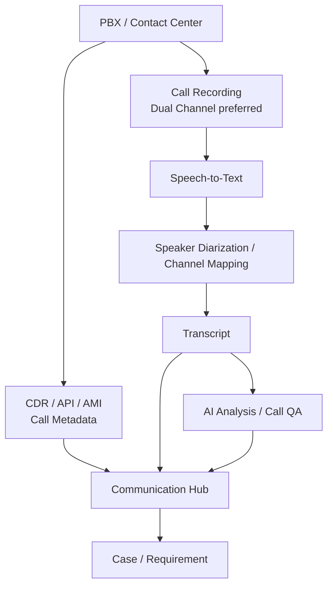

# 04 — Call Recording → STT → AI

## 1. Nguyên tắc

CDR/Call Status chỉ cung cấp metadata. Muốn hiểu nội dung cuộc gọi phải có **Call Recording / Media Access** hoặc nhà cung cấp Contact Center hỗ trợ transcription.

## 2. Kiến trúc khuyến nghị



## 3. Dual-channel

Ưu tiên recording có:

```text
Channel 1 = Customer
Channel 2 = Company / Agent
```

Nếu chỉ có mono recording thì phải dùng diarization để tách speaker, nhưng độ tin cậy cần được kiểm thử.

## 4. Transcript phải giữ timestamp

Ví dụ:

```text
00:00 CUSTOMER: Website bên anh chậm.
00:06 COMPANY: Anh gặp từ lúc nào?
00:11 CUSTOMER: Khoảng 9 giờ.
```

Transcript phải liên kết ngược được tới recording segment.

## 5. Vendor candidates

### Azure Speech + Language

Phù hợp khi Company muốn giữ Communication Hub và business logic của mình. Azure có call-center transcription, diarization/speaker processing và Language analytics.

### Amazon Connect Contact Lens

Phù hợp khi cần Contact Center analytics, transcription, sentiment, categorization và agent quality evaluation. Có thể xem xét external voice integration tùy khu vực/tính năng.

### Google Speech-to-Text

Phù hợp khi muốn một STT engine độc lập rồi tự xây analytics pipeline.

## 6. Call Quality / Rating

Có thể tạo 2 loại score:

### Customer Rating

CSAT sau cuộc gọi:

`1–5 stars` hoặc thang đo tương đương.

### AI Call QA

Đánh giá:

- Greeting
- Requirement discovery
- Accuracy
- Scope confirmation
- No unauthorized commitment
- Process compliance
- Customer confirmation
- Closing

## 7. Data lưu

```text
call_metadata
call_recording
transcript
transcript_segments
speaker_map
ai_analysis
call_quality_score
customer_rating
```

Raw audio không được thay thế bởi transcript.
