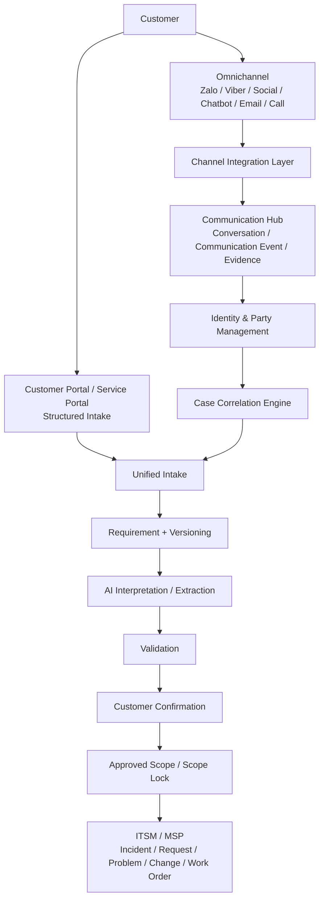

# Kiến trúc Tổng thể Final

## Mục đích

Đây là bộ tài liệu kiến trúc tổng thể Final cho **Customer ITSM / MSP Management Platform**, hợp nhất các phần đã phân tích về Customer Portal, Service Portal, Omnichannel, Communication Hub, Identity, Case Correlation, AI, Requirement Governance và ITSM/MSP Execution.

## Kiến trúc chốt



## Nguyên tắc bắt buộc

1. **Customer Portal / Service Portal là Structured Intake**: dữ liệu có cấu trúc đi trực tiếp vào Unified Intake.
2. **Omnichannel không phải Ticket Generator**: Zalo/Viber/Social/Chatbot/Email/Call chỉ tạo Communication Events và liên kết Case; không tự tạo Ticket trùng.
3. **Channel ≠ Customer**: channel ID chỉ là external identity.
4. **Customer Identity ≠ Contract**: khách vãng lai vẫn được ghi nhận bằng Interaction Identity tạm thời.
5. **One Case – Multiple Channels**: một Case có thể có Portal + Zalo + Email + Call + Chat.
6. **Raw Evidence bất biến**: không overwrite message, email, audio, attachment bởi AI/Sales.
7. **AI ≠ Source of Truth**: AI chỉ extract/classify/suggest; không tự biến suy luận thành Approved Data.
8. **Every important fact has provenance**: value, source, source_event_id, confidence, verification_status và version.
9. **Low-confidence correlation không auto-link**: phải hỏi khách/agent hoặc tạo manual review.
10. **Requirement Versioning**: thay đổi yêu cầu tạo version mới, không xóa lịch sử.
11. **No Approved Scope → No Execution**: IT chỉ thực hiện Approved Scope; phát sinh thêm phải đi qua Change/Additional Work.
12. **Data Lineage** phải truy ngược được từ Work Order → Scope → Requirement → Conversation → Communication Event → Original Evidence.

## Các kênh và cách tích hợp

### Customer Portal / Service Portal

```text
Portal → Structured Request → Unified Intake → Requirement → ITSM
```

### Zalo / Viber / Social

```text
Channel API/Webhook → Connector → Communication Hub → Identity → Case Correlation
```

### Web Chatbot

```text
Web Chatbot → API → Communication Hub → AI → Requirement
```

### Email

```text
Mailbox → Graph/API/Webhook → Email Connector → Communication Hub
```

Giữ `Message-ID`, `Thread-ID`, `In-Reply-To`, attachment và timestamp để correlation chính xác.

### Call

```text
PBX
├── CDR / Call Metadata
└── Call Recording
      ↓
Dual Channel (ưu tiên)
      ↓
Speech-to-Text / Diarization
      ↓
Transcript
      ↓
Communication Hub
      ↓
AI Analysis / Call QA
```

Không thể lấy nội dung cuộc gọi chỉ từ CDR/status API. Muốn có text phải có Recording/Media Access hoặc Contact Center hỗ trợ transcription.

## Identity & Party

```text
Interaction Identity
        ↓
Contact / Organization
        ↓
Prospect / Customer
        ↓
Contract
        ↓
Service Entitlement / SLA
```

### Khách vãng lai

```text
Unknown Interaction Identity → Case
```

Sau khi xác minh mới liên kết với Contact/Organization/Customer/Contract.

## Case Correlation

Ưu tiên mapping theo thứ tự:

1. Case ID / explicit reference.
2. Conversation ID / Email Thread ID.
3. Verified Channel Identity.
4. Service + Asset + Time + Open Case context.
5. AI semantic similarity.

Khuyến nghị ngưỡng khởi đầu:

- `> 90%`: Auto Link.
- `70–90%`: Ask Customer/Agent.
- `< 70%`: Manual Review / New Intake.

Các ngưỡng phải được hiệu chỉnh bằng dữ liệu thực tế trước khi production.

## Data Lifecycle

```text
RAW EVIDENCE
   ↓
EXTRACTED
   ↓
VALIDATED
   ↓
CUSTOMER CONFIRMED
   ↓
APPROVED
   ↓
WORK ORDER
```

## Call Vendor Strategy

### Phương án ưu tiên khi giữ Core Platform của Công ty

- **Azure Speech + Language**: dùng Recording từ PBX, Speech-to-Text, diarization/speaker processing và hậu xử lý Language; business logic vẫn thuộc Platform của Công ty.
- **Amazon Connect Contact Lens**: phù hợp nếu cần Contact Center analytics, transcript, sentiment và agent quality evaluation; có thể xem xét external voice integration theo phạm vi tính năng/khu vực hỗ trợ.
- **Google Speech-to-Text**: phù hợp như STT engine độc lập khi tự xây pipeline.

## Data Model lõi

### Party

- organizations
- contacts
- interaction_identities
- customer_relationships
- contracts
- services

### Communication

- channels
- conversations
- communication_events
- attachments
- call_recordings
- transcripts
- raw_events

### Intake / ITSM

- cases
- requirements
- requirement_versions
- evidence_links
- confirmations
- scopes
- incidents
- service_requests
- problems
- changes
- work_orders
- sla_records

### Governance

- audit_logs
- correlation_records
- validation_records
- confidence_scores

## Vai trò của hệ thống

```text
Channel Providers
    = Input Transport

Communication Hub
    = Evidence + Conversation System

Identity & Correlation
    = Who / Which Case

AI
    = Interpretation / Extraction

Customer Confirmation
    = Authority for Customer Requirements

ITSM / MSP
    = System of Record for Operational Work

Bitrix24 (nếu dùng)
    = Internal Collaboration / Task Execution
```

## Mục tiêu cuối cùng

> **Capture → Identify → Correlate → Interpret → Validate → Confirm → Lock → Execute → Verify → Improve**

Đây là kiến trúc Final làm baseline cho thiết kế Product, Database, API, UI/UX, Integration, Security, AI và triển khai thực tế.