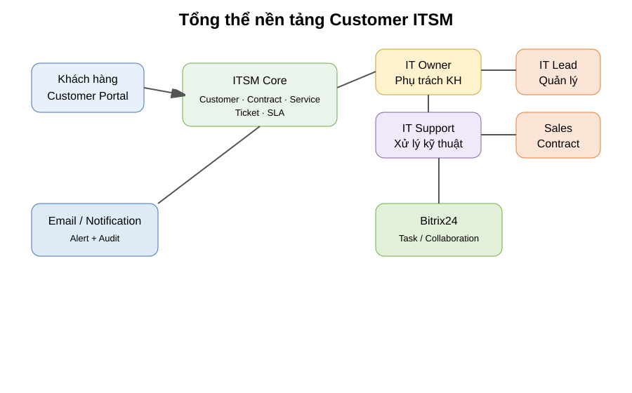
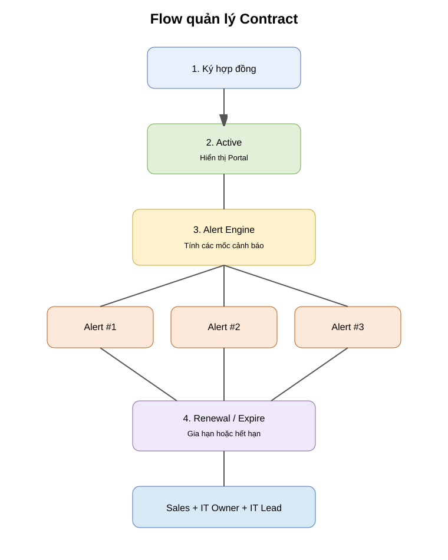
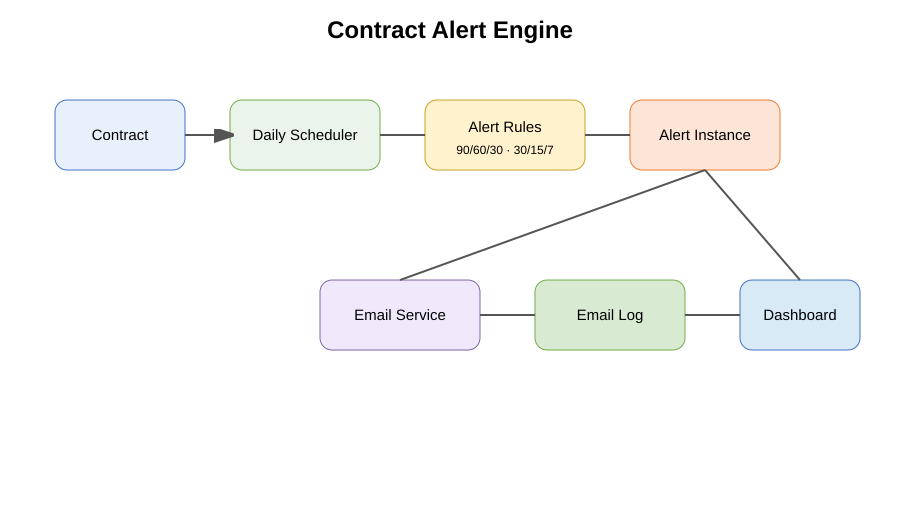

# 01 — BOD / Business Case

## 1. Executive Summary

### Mục đích của dự án

Xây dựng một nền tảng Customer ITSM cho mô hình MSP để doanh nghiệp kiểm soát được **toàn bộ vòng đời quan hệ dịch vụ với khách hàng** thay vì để thông tin phân tán ở Email, Zalo, Excel, thư mục hợp đồng và các công cụ cộng tác.

Hai bài toán phải được giải quyết đồng thời:

1. **Không mất / không quên yêu cầu của khách hàng.**
2. **Không quên / không bỏ sót thời hạn hợp đồng.**

Hai bài toán này liên kết trực tiếp với doanh thu, trải nghiệm khách hàng, SLA và khả năng gia hạn hợp đồng.

## 2. Vì sao phải làm

### 2.1. Rủi ro Ticket

Khi khách hàng gửi yêu cầu qua nhiều kênh, doanh nghiệp khó đảm bảo:

- Yêu cầu có được ghi nhận đầy đủ không.
- Ai đang chịu trách nhiệm chính.
- Đang ở bước nào.
- Có vi phạm SLA không.
- Khi Customer không đồng ý sau khi Resolve thì ai biết.
- Ticket có lịch sử xử lý đầy đủ để đối soát hay không.

### 2.2. Rủi ro Contract

Nếu quản lý hạn hợp đồng thủ công:

- Dễ quên ngày hết hạn.
- Không biết đã gửi cảnh báo lần 1/2/3 hay chưa.
- Sales, IT Owner và IT Lead có thể theo dõi các file khác nhau.
- Có nguy cơ bỏ lỡ thời điểm gia hạn.
- Mất cơ hội doanh thu lặp lại hoặc tạo ra rủi ro gián đoạn dịch vụ.

## 3. Giá trị kinh doanh kỳ vọng

| Nhóm giá trị | Kết quả mong muốn |
|---|---|
| Customer Experience | Khách hàng biết yêu cầu đã được tiếp nhận, ai xử lý, đang ở đâu, đã hoàn thành hay chưa |
| SLA & Service Quality | Giảm nguy cơ quên Ticket, tăng khả năng kiểm soát SLA |
| Operational Control | IT Owner/IT Lead quản lý theo dashboard thay vì theo trí nhớ |
| Contract Renewal | Cảnh báo tự động theo chu kỳ và có bằng chứng đã gửi |
| Accountability | Mọi bước đều có người, thời gian, trạng thái và audit |
| Scalability | Tăng số lượng khách hàng mà không tăng tỷ lệ quản lý thủ công tương ứng |
| Data | Có dữ liệu để phân tích tải support, chất lượng dịch vụ và cơ hội gia hạn |

## 4. To-Be Operating Model

## 5. Ticket Management — mục đích ở cấp BOD

### Luồng chính

Customer → Portal → ITSM → IT Owner → IT Support → Resolve → Customer Confirm / Reopen.

### Tại sao phải có IT Owner tách khỏi IT Support?

IT Owner chịu trách nhiệm về **quan hệ dịch vụ với khách hàng** và điều phối; IT Support chịu trách nhiệm về **thực thi kỹ thuật**. Cách tách vai trò này giúp:

- Khách hàng có một điểm chịu trách nhiệm rõ ràng.
- IT Support không bị phân tán bởi quản lý quan hệ khách hàng.
- IT Lead có thể quản lý năng lực và tải của cả đội.

### Reopen là một “control point”

Ticket không được coi là “đã xong” chỉ vì IT Support đánh dấu Resolved. Customer phải có quyền xác nhận hoặc Reopen.

Nếu Reopen:

- Ghi nhận lý do.
- Báo ngay IT Owner.
- Báo IT Lead.
- Báo lại IT Support.
- Có thể kích hoạt escalation theo rule.

Điều này biến “khách hàng không hài lòng” thành một tín hiệu quản trị có thể hành động được.

## 6. Contract Management — mục đích ở cấp BOD

### Hợp đồng là một tài sản kinh doanh, không chỉ là file PDF

Hệ thống phải quản lý:

- Thông tin hợp đồng.
- Dịch vụ thuộc hợp đồng.
- Thời hạn.
- SLA.
- IT Owner.
- IT Lead.
- Sales phụ trách.
- Tài liệu đính kèm.
- Lịch sử cảnh báo.
- Lịch sử gia hạn.

### Customer cũng nhìn thấy Contract

Customer Portal hiển thị phần hợp đồng được phép công khai. Điều này tăng tính minh bạch và giảm câu hỏi “hợp đồng của chúng tôi còn đến bao giờ?”.

## 7. Cơ chế 3 lần cảnh báo

Hệ thống có Alert Engine. Ví dụ:

- Hợp đồng 12 tháng: 90 / 60 / 30 ngày trước hạn.
- Hợp đồng 3 tháng: 30 / 15 / 7 ngày trước hạn.

Không hard-code; Admin có thể cấu hình theo policy/hợp đồng.

### Thành phần nhận cảnh báo

- IT Owner: To.
- IT Lead: Cc.
- Sales của hợp đồng: Cc.
- Customer contract contact: email riêng nếu policy cho phép.

### Tại sao phải lưu “đã gửi lần 1/2/3”?

Vì BOD cần chứng minh được:

> “Hệ thống đã cảnh báo đúng lịch, ai nhận, lúc nào, thành công hay lỗi.”

## 8. KPI nên theo dõi

### Ticket

- % Ticket có Owner.
- % Ticket được assign trong thời gian mục tiêu.
- SLA compliance %.
- SLA breach count.
- Reopen rate.
- First response time.
- Mean time to resolve.
- Customer satisfaction / CSAT.
- Ticket volume theo Customer / Service / Contract.

### Contract

- Số hợp đồng active.
- Số hợp đồng hết hạn < 7 / 30 / 90 ngày.
- % hợp đồng được cảnh báo đúng lịch.
- % hợp đồng gia hạn đúng hạn.
- Renewal rate.
- Contract value at risk.

## 9. Các câu hỏi quản trị mà hệ thống phải trả lời được

1. Hôm nay khách hàng nào có Ticket P1/P2?
2. Ticket nào có nguy cơ vi phạm SLA?
3. Khách hàng nào có nhiều Ticket Reopen?
4. IT Owner nào đang quá tải?
5. Hợp đồng nào sắp hết hạn?
6. Hợp đồng nào đã gửi Alert #1/#2/#3?
7. Hợp đồng nào chưa được Sales xử lý gia hạn?
8. Customer nào có mức sử dụng Support cao bất thường?
9. Hợp đồng nào có nhiều sự cố nhưng giá trị thấp, cần xem lại phạm vi/SLA?

## 10. Kết luận dành cho BOD

Đây không phải dự án “làm một phần mềm Ticket”. Đây là dự án xây **năng lực vận hành MSP có kiểm soát**.

Hệ thống tạo ra 4 lớp kiểm soát:

1. **Customer Control** — khách hàng nhìn thấy yêu cầu và hợp đồng của mình.
2. **Operational Control** — IT Owner/Support/Lead biết việc và trách nhiệm.
3. **Commercial Control** — Sales và quản lý không quên gia hạn.
4. **Data Control** — lịch sử, SLA, notification và audit trở thành dữ liệu có thể đo lường.
