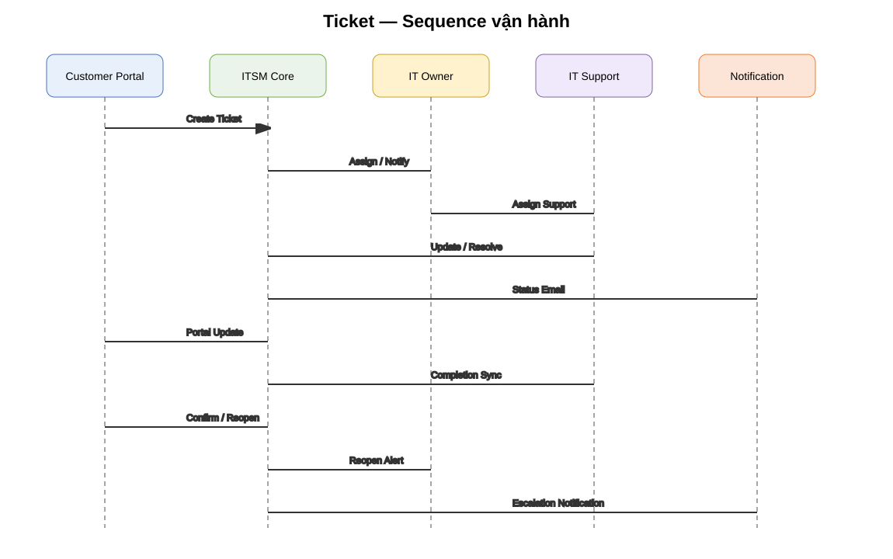

# 02 — DEV / Product / UIUX Specification

## 1. Phạm vi

Tài liệu này là baseline để Product, UX/UI, Backend và Frontend triển khai 2 module:

- Customer / Ticket Management.
- Contract Management & Contract Expiry Alert.

## 2. Vai trò người dùng

| Role | Scope |
|---|---|
| Customer Admin | Users/contact của Customer, Contracts/Tickets trong Customer |
| Customer User | Tickets và dữ liệu Customer được cấp quyền |
| IT Owner | Customer được phân phụ trách; điều phối Ticket |
| IT Support | Ticket được assign tới user/group |
| IT Lead | Toàn bộ IT scope, escalation, report |
| Sales | Customer/Contract thuộc scope Sales |
| Contract Admin | Quản lý Contract/Alert policy |
| System | Workflow, SLA, notification, scheduler, audit |

## 3. Information Architecture

### Customer Portal

- Dashboard
- Create Ticket
- My Tickets
- Ticket Detail
- Contracts
- Contract Detail
- Services
- Profile / Contacts

### Internal Portal

- Dashboard
- Customers
- Contracts
- Tickets
- My Queue
- SLA / Escalation
- Reports
- Knowledge Base (phase sau)
- Administration

## 4. UX principles

1. **Ticket là object trung tâm**: mọi thay đổi hiển thị trên timeline.
2. **Trạng thái luôn nhìn thấy**: badge + label + timestamp.
3. **SLA luôn nhìn thấy trên Ticket nội bộ**.
4. **Action theo vai trò**: Customer không thấy action nội bộ.
5. **Không xoá lịch sử**: audit append-only.
6. **Form giảm lựa chọn thủ công**: Customer không tự chọn Contract nếu hệ thống xác định được từ Service.
7. **Exception-first dashboard**: Manager nhìn việc cần xử lý trước.

# 5. TICKET MANAGEMENT

## 5.1. Ticket State Machine

```text
NEW
 ↓
ASSIGNED
 ↓
IN_PROGRESS
 ├── WAITING_CUSTOMER
 ├── WAITING_VENDOR
 └── IN_PROGRESS
 ↓
RESOLVED
 ├── CUSTOMER_CONFIRMED → CLOSED
 └── CUSTOMER_REOPENED → REOPENED → IN_PROGRESS
```

### Quy tắc

- `NEW → ASSIGNED`: phải có Owner/Group.
- `ASSIGNED → IN_PROGRESS`: Support bắt đầu xử lý.
- `IN_PROGRESS → WAITING_CUSTOMER`: chỉ khi cần dữ liệu/feedback từ Customer.
- `IN_PROGRESS → RESOLVED`: bắt buộc Resolution Note.
- `RESOLVED → CLOSED`: Customer confirm hoặc auto-close theo policy.
- `RESOLVED → REOPENED`: Customer phải cung cấp Reopen Reason.
- `REOPENED`: lập tức tạo notification cho IT Owner + IT Lead + assigned Support.

## 5.2. UI-01 — Customer Dashboard

### Mục đích

Cho Customer biết ngay:

- Ticket đang mở.
- Ticket đang xử lý.
- Ticket đã hoàn thành.
- Ticket bị Reopen.
- Contract đang active/sắp hết hạn.

### Layout

```text
[Header]
Logo | Company | Notification | User

[Sidebar]
Dashboard
Tickets
Contracts
Services
Profile

[Content]
KPI cards
Open | In Progress | Resolved | Reopened

[Primary CTA]
+ Create New Ticket

[Recent Tickets]
ID | Subject | Service | Status | Updated
```

## 5.3. UI-02 — Create Ticket

### Fields

| Field | Rule |
|---|---|
| Service | Required |
| Subject | Required, 5–200 chars |
| Description | Required |
| Attachment | Optional, file type/size policy |
| Customer Contact | Auto from logged-in user |
| Contract | Auto by Customer + Service; selectable only when multiple valid contracts |
| Priority | System/IT Owner controlled; optionally customer urgency input |

### Validation

- Không cho submit nếu Service không thuộc Customer.
- Nếu không xác định được Contract → route vào manual review queue.
- Ticket phải nhận unique ID.

## 5.4. Ticket Create Backend Flow



Backend transaction:

1. Validate authenticated Customer.
2. Resolve Contact.
3. Resolve valid Contract.
4. Resolve Service.
5. Resolve SLA.
6. Calculate SLA due timestamps.
7. Determine IT Owner.
8. Persist Ticket + initial history.
9. Commit.
10. Queue notifications asynchronously.

## 5.5. UI-03 — IT Owner Dashboard

### KPI

- My Customers.
- Open Tickets.
- SLA At Risk.
- SLA Breached.
- Reopened.
- Unassigned.

### Ticket table

Columns:

`Ticket ID | Customer | Contract | Service | Priority | Status | SLA Timer | Assigned Support | Updated | Actions`

### Filters

Customer, Contract, Service, Priority, Status, Support, SLA state, date range.

## 5.6. UI-04 — IT Owner Ticket Detail

### Header

- Ticket ID.
- Subject.
- Customer.
- Contract.
- Service.
- Priority.
- Status.
- SLA timer.

### Main content

**Left/Main**: description + timeline + attachments + comments.

**Right**: customer summary + assignment + SLA + key metadata.

### Actions

- Assign Support.
- Reassign.
- Change Priority.
- Escalate.
- Add Internal Note.
- Add Customer Reply.
- Resolve.

## 5.7. UI-05 — IT Support Queue

### KPI

New / In Progress / Waiting Customer / SLA Warning / Reopened.

### Ticket action

- Accept.
- Start Work.
- Add Worklog.
- Ask Customer.
- Attach evidence.
- Resolve.

### Resolve validation

Required:

- Resolution Summary.
- Resolution Category.
- Optional Worklog duration.
- Root cause field only if policy requires.

## 5.8. UI-06 — Customer Confirm / Reopen

When status = `RESOLVED`:

```text
Did this resolve your issue?

[ YES — CLOSE TICKET ]
[ NO — REOPEN TICKET ]
```

Reopen modal:

- Reopen reason: required.
- Attachment: optional.
- Submit.

After submit:

- Ticket status = `REOPENED`.
- `reopen_count += 1`.
- Create ticket history.
- Generate alerts.

## 5.9. Reopen Escalation Rules

Minimum rule:

```text
Customer Reopen
→ notify IT Owner
→ notify IT Lead
→ notify current Support
```

Optional rules:

- Reopen count >= 2 → escalate priority.
- Reopen count >= 3 → flag `problem_candidate = true`.
- Reopen after SLA resolved within configurable window → manager review.

## 5.10. IT Lead Dashboard

Manager sees exceptions:

- SLA breach.
- SLA at risk.
- P1/P2.
- Reopened.
- Unassigned > threshold.
- Customer escalation.
- Technician overload.

# 6. CONTRACT MANAGEMENT

## 6.1. Contract Lifecycle

```text
DRAFT
 ↓
PENDING_SIGNATURE
 ↓
ACTIVE
 ↓
EXPIRING
 ├── RENEWED → ACTIVE (new period / new version)
 └── EXPIRED
```

## 6.2. UI-07 — Contract List

Columns:

`Contract No | Customer | Service | Start Date | End Date | Status | Alert #1 | Alert #2 | Alert #3 | IT Owner | Sales | Actions`

### Status rules

- `ACTIVE`: còn hiệu lực và chưa vào ngưỡng Expiring.
- `EXPIRING`: nằm trong policy window.
- `EXPIRED`: End Date < current date và chưa có renewal hiệu lực.
- `RENEWED`: contract version cũ đã được thay bằng period mới.

## 6.3. UI-08 — Contract Detail

Sections:

1. Contract Summary.
2. Customer.
3. Services.
4. SLA.
5. Contract Dates.
6. Contacts.
7. Attachments.
8. Internal Owners.
9. Alert Policy.
10. Alert History.
11. Renewal History.
12. Audit Timeline.

## 6.4. Customer Portal — Contract Detail

Customer được xem các field được whitelist:

- Contract number.
- Service.
- Start date.
- End date.
- Status.
- Scope of service.
- SLA summary nếu commercial policy cho phép.
- Approved contract document nếu policy cho phép.

Không show mặc định:

- Cost.
- Margin.
- Commission.
- Internal note.
- Internal escalation.

## 6.5. Alert Rule

Không hard-code 90/60/30. Dữ liệu dạng policy:

```text
contract_alert_rules
- alert_no
- trigger_days_before_expiry
- enabled
- recipient_policy
- template_id
```

Ví dụ:

```text
Rule A: 90 / 60 / 30
Rule B: 30 / 15 / 7
```

## 6.6. UI-09 — Alert History

Columns:

`Alert # | Scheduled Date | Sent Date | Status | To | CC | Template | Message ID | Retry Count | Error`

Status:

- PENDING.
- SENT.
- FAILED.
- SKIPPED.
- CANCELLED.

## 6.7. Alert Engine


Daily scheduler:

```text
Scheduler
→ find active contracts
→ calculate due alerts
→ check alert instance already sent
→ create pending instance
→ queue email
→ update result
→ audit
```

### Idempotency

Unique key khuyến nghị:

`contract_id + alert_no + expiry_date`

Không được gửi lại cùng Alert Instance do cron chạy nhiều lần.

## 6.8. Email recipient policy

Internal:

- To: IT Owner.
- CC: IT Lead + Sales.

Customer:

- Email riêng cho Customer Contract Contact khi policy bật.

Không trộn recipient internal và external nếu template có dữ liệu nội bộ.

## 6.9. UI-10 — Contract Dashboard

KPI:

- Active.
- Expiring < 7 days.
- Expiring < 30 days.
- Expiring < 90 days.
- Expired.
- Renewal in progress.

Exception list:

- Alert failed.
- Contract expiring nhưng chưa có owner.
- Contract expiring nhưng chưa có renewal activity.

# 7. NOTIFICATION SPECIFICATION

## Ticket events

| Event | Customer | IT Owner | IT Lead | Support |
|---|---:|---:|---:|---:|
| Ticket Created | ✅ | ✅ | tùy policy | nếu assigned |
| Assigned Support | optional | ✅ | optional | ✅ |
| Status Changed | ✅ | ✅ | optional | ✅ |
| Resolved | ✅ | ✅ | optional | ✅ |
| Customer Reopen | ✅ confirmation | ✅ | ✅ | ✅ |
| SLA Breach | optional | ✅ | ✅ | ✅ |

## Contract events

| Event | Customer | IT Owner | IT Lead | Sales |
|---|---:|---:|---:|---:|
| Alert #1 | policy | ✅ | ✅ | ✅ |
| Alert #2 | policy | ✅ | ✅ | ✅ |
| Alert #3 | policy | ✅ | ✅ | ✅ |
| Expired | policy | ✅ | ✅ | ✅ |
| Renewal | ✅/policy | ✅ | ✅ | ✅ |

## Email requirements

Mỗi email phải có:

- event code.
- template version.
- timestamp.
- recipient list.
- status.
- provider/message ID nếu có.
- retry count.

# 8. BITRIX24 INTEGRATION

## Nguyên tắc

ITSM là System of Record cho Ticket.

Bitrix24 có thể nhận một task nội bộ tương ứng với Ticket.

Mapping tối thiểu:

```text
ITSM ticket_id ↔ Bitrix task_id
```

### Không cho phép 2 hệ thống trở thành 2 nguồn sự thật độc lập.

### Có thể đồng bộ

- Assignment.
- Task status.
- Due date.
- Comment/worklog theo policy.
- Completion.

### Không đồng bộ mặc định

- Internal customer secrets.
- Commercial fields không cần cho Support.
- Audit record gốc.

## 8.1. Failure handling

Nếu Bitrix24 API lỗi:

- Ticket ITSM vẫn hoạt động.
- Ghi integration log.
- Retry queue.
- Hiển thị `Sync Pending` cho IT Owner nếu cần.

# 9. UI COMPONENT GUIDELINES

## Status

Dùng cả **màu + text + icon**; không dùng màu đơn độc.

## Priority

P1 Critical / P2 High / P3 Medium / P4 Low.

## SLA

Hiển thị Time remaining / At Risk / Breached.

## Tables

Search, Filter, Sort, Pagination, Export theo permission, Column preference.

## Forms

Required indication, server-side validation, inline error, prevent double submit, unsaved changes warning.

# 10. SECURITY / AUDIT

Tất cả mutation quan trọng phải có audit:

- actor.
- action.
- object type.
- object id.
- old/new value nếu phù hợp.
- timestamp.
- IP / user-agent theo security policy.

Actions bắt buộc audit: ticket assignment, priority/status change, reopen, resolve, close, contract create/update, alert rule update, renewal, permission change.

# 11. NON-FUNCTIONAL REQUIREMENTS

- List pages dùng server-side pagination.
- Dashboard query có index/aggregation phù hợp.
- Email/notification chạy asynchronous.
- Retry có backoff.
- Idempotency cho Alert.
- RBAC + object-level customer scope.
- Attachment access control.
- Session timeout theo policy.
- Application / integration / email / scheduler logs.

# 12. DEV DELIVERY CHECKLIST

### Ticket

- [ ] Customer Portal create ticket.
- [ ] Contract/service auto-resolution.
- [ ] SLA calculation.
- [ ] IT Owner assignment.
- [ ] Support assignment.
- [ ] Timeline.
- [ ] Resolve.
- [ ] Customer confirm.
- [ ] Reopen with reason.
- [ ] Reopen escalation.
- [ ] SLA warning/breach.
- [ ] Notification log.

### Contract

- [ ] Contract CRUD.
- [ ] Contract services.
- [ ] Contract document.
- [ ] Customer visibility.
- [ ] Alert policy.
- [ ] Alert instance.
- [ ] Email schedule.
- [ ] Email history.
- [ ] Renewal history.
- [ ] Expired state.

### Platform

- [ ] RBAC.
- [ ] Customer-scoped access.
- [ ] Audit.
- [ ] Search/filter/export.
- [ ] Integration retry.
- [ ] Scheduler monitoring.
