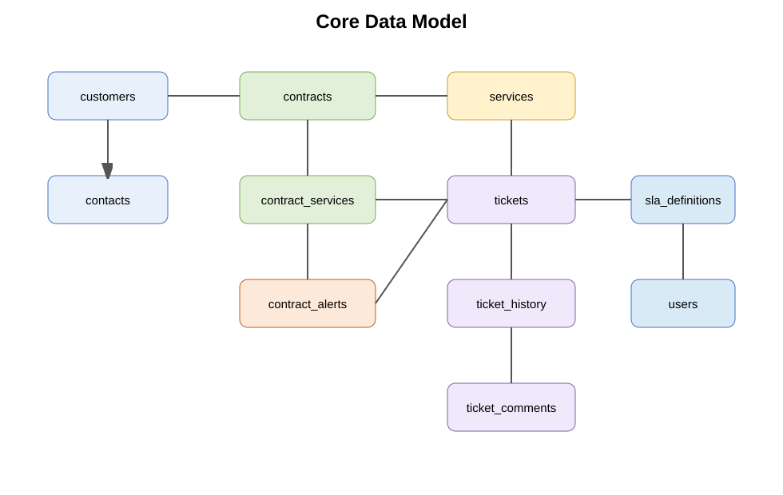

# 03 — Data Model & Technical Blueprint

## 1. Core entity map

## 2. Proposed tables

### customers

- id
- code
- name
- status
- tax_code
- address
- primary_contact_id
- it_owner_id
- created_at
- updated_at

### customer_contacts

- id
- customer_id
- name
- email
- phone
- role
- portal_user_id
- is_primary
- status

### services

- id
- code
- name
- category
- active

### contracts

- id
- contract_no
- customer_id
- contract_type
- start_date
- end_date
- status
- value
- currency
- owner_user_id
- it_lead_id
- sales_user_id
- previous_contract_id
- renewal_of_id
- visibility_policy
- created_at
- updated_at

### contract_services

- id
- contract_id
- service_id
- scope
- sla_id
- included_quantity / hours nếu cần
- billable_policy

### contract_alert_rules

- id
- contract_id hoặc policy_id
- alert_no
- trigger_days_before_expiry
- enabled
- template_id
- recipient_policy_id

### contract_alerts

- id
- contract_id
- alert_rule_id
- alert_no
- expiry_date_snapshot
- scheduled_at
- sent_at
- status
- retry_count
- provider_message_id
- error_message

### contract_documents

- id
- contract_id
- file_id
- document_type
- visibility
- version
- uploaded_by

### tickets

- id
- ticket_no
- customer_id
- contact_id
- contract_id
- service_id
- sla_id
- priority
- status
- source
- subject
- description
- assigned_group_id
- assigned_to
- it_owner_id
- reopen_count
- first_response_at
- resolved_at
- closed_at
- created_at
- updated_at

### ticket_history

- id
- ticket_id
- actor_id
- event_type
- from_status
- to_status
- metadata_json
- created_at

### ticket_comments

- id
- ticket_id
- author_id
- visibility (`CUSTOMER`, `INTERNAL`)
- body
- created_at

### ticket_attachments

- id
- ticket_id
- comment_id nullable
- file_id
- visibility

### sla_definitions

- id
- name
- priority
- response_target_minutes
- resolve_target_minutes
- business_calendar_id
- escalation_policy_id

### users / roles / permissions

RBAC + scope mapping theo global / customer / group.

### notifications / email_logs / audit_logs

Tách riêng khỏi business entity để giữ lịch sử và khả năng retry.

## 3. Business rules

### Contract lookup for Ticket

Nếu Customer + Service có đúng một Contract active hợp lệ → auto select.

Nếu có nhiều Contract active → yêu cầu lựa chọn hoặc rule ưu tiên.

Nếu không có Contract → route `Contract Review Required`.

### Ticket ownership

IT Owner lấy từ Customer master hoặc Contract assignment policy.

### SLA

SLA lấy theo thứ tự ưu tiên khuyến nghị:

1. Contract + Service override.
2. Customer policy.
3. Global default.

## 4. API modules

### Customer Portal API

- `POST /api/v1/tickets`
- `GET /api/v1/tickets`
- `GET /api/v1/tickets/{id}`
- `POST /api/v1/tickets/{id}/comments`
- `POST /api/v1/tickets/{id}/reopen`
- `POST /api/v1/tickets/{id}/confirm`
- `GET /api/v1/contracts`
- `GET /api/v1/contracts/{id}`

### Internal API

Customer management, Contract CRUD, Ticket assignment, SLA, Dashboard, Reports.

### Integration API

Bitrix task create/update, Bitrix completion sync, Email service.

## 5. Background workers

1. SLA evaluator.
2. Contract alert scheduler.
3. Notification dispatcher.
4. Email retry worker.
5. Bitrix integration retry worker.
6. Dashboard aggregation worker nếu cần.

## 6. Idempotency

### Contract alert

Unique key: `contract_id + alert_no + expiry_date_snapshot`

### Notification event

Có event_id duy nhất; consumer xử lý idempotent.

## 7. Audit strategy

Không update mất lịch sử. Thay đổi quan trọng tạo audit event.

## 8. Suggested indexing

### tickets

- `(customer_id, status)`
- `(contract_id, status)`
- `(assigned_to, status)`
- `(priority, status)`
- `(created_at)`
- `(updated_at)`

### contracts

- `(customer_id, status)`
- `(end_date, status)`
- `(sales_user_id, status)`
- `(owner_user_id, status)`

### contract_alerts

- unique `(contract_id, alert_no, expiry_date_snapshot)`
- `(status, scheduled_at)`

## 9. Recommended implementation principle

Không hard-code business policy vào UI. UI đọc configuration từ API; backend là nơi enforce rule cuối cùng.
